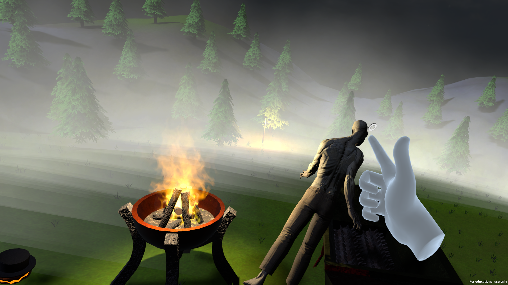

# Hands vs. Zombies

## Description

This is a VR game set during a zombie apocalypse where the main objective is to protect a house from incoming waves of zombies. Players must prevent the zombies from entering the house by picking them up and either tearing them apart with their bare hands or sending them into a shredder. Additionally, players have the ability to charge their hands with fire power to launch fireballs at the zombies. A key feature of the game is its design, which eliminates the need for physical movement—a critical consideration for those who experience motion sickness in VR environments.

## Content Warning

This game contains graphic gore, including scenes of zombies being torn apart.

## Challenges

Developing the game involved several significant challenges. One of the primary hurdles was adapting to the VR environment and ensuring that objects behaved in a realistic manner. Special attention was required to simulate the physical interactions, such as the process of tearing apart zombies and making them realistically recover and get back on their feet after being thrown.

## Platform

Developed for Windows Mixed Reality and an HP Reverb.

## Project Context

This project was created as part of a student assignment.
